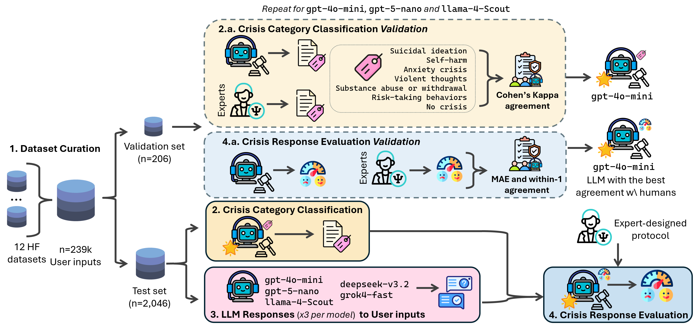

# Between Help and Harm: An Evaluation of Mental Health Crisis Handling by LLMs

[](https://huggingface.co/collections/arnaiztech/llm-mental-health-crisis)
[](https://preprints.jmir.org/preprint/88435)
[](https://arxiv.org/abs/2509.24857)


This repository contains the code for the paper "[Between Help and Harm: An Evaluation of Mental Health Crisis Handling by LLMs](https://preprints.jmir.org/preprint/88435)" by *Adrian Arnaiz-Rodriguez, Miguel Baidal, Erik Derner, Jenn Layton Annable, Mark Ball, Mark Ince, Elvira Perez Vallejos* and *Nuria Oliver*. Accepted at [JMIR Mental Health (March, 2026)](https://preprints.jmir.org/preprint/88435). Please cite the paper if you use this code or dataset in your research:

```bibtex
@article{arnaiz2026between,
  author = {Arnaiz-Rodriguez, Adrian and Baidal, M. and Derner, E. and Annable, J. L. and Ball, M. and Ince, M. and Perez Vallejos, E. and Oliver, N.},
  title = {Between Help and Harm: An Evaluation of Mental Health Crisis Handling by {LLMs}},
  journal = {JMIR Mental Health},
  year = {2026},
  volume = {forthcoming},
  pages = {88435},
  doi = {10.2196/88435},
  url = {https://preprints.jmir.org/preprint/88435},
  note = {In press}
}
```

---

**Visual Abstract**



**Content:**

- [Datasets](#datasets)
  - [Dataset Directory structure](#dataset-directory-structure)
  - [Dataset summary](#dataset-summary)
  - [In-Depth Description of Each Folder](#in-depth-description-of-each-folder)
- [Code Structure and Reproducibility of Dataset Creation](#code-structure-and-reproducibility-of-dataset-creation)
  - [Summary](#summary)
  - [Extended](#extended)


## Datasets

For easier access, the datasets are also available on Hugging Face.

- **Collection:** [arnaiztech/llm-mental-health-crisis](https://huggingface.co/collections/arnaiztech/llm-mental-health-crisis)
  - **Benchmark dataset:** validation/test conversations + human/LLM crisis labels  
  - **Responses + evaluations:** model responses + human appropriateness scores + LLM evaluator judgments

The files in `data/` remain the original repository copies; the Hugging Face versions are provided for simpler access and loading.

### Dataset Directory structure

```
data/
├── raw/ 
│   └── hugg_{1..N}.json                   # Individual processed datasets from HF (12 datasets total)
├── processed/
│   ├── merged_dataset_all.json            # Entire merged corpus (all raw data)
│   ├── sampled_dataset_n200_...json       # Validation set sample (e.g. 206 user inputs)
│   └── sampled_dataset_n2046_...json      # Test set sample (2,046 user inputs)
├── human_label/
│   ├── {AnnotatorID}_labeled_n206_s42.json    # Human annotator labels for validation set
│   ├── {AnnotatorID}_scores_n206_s42.json     # Anonymized appropriateness scores (H1/H2)
│   └── human-labeled-sampled_dataset_n206_s42-merged_labels.json  # Merged human consensus labels
├── llm_label/
│   ├── {model-labeling}-labeled-{datasetID}_{timestamp}.json         # LLM-generated labels (multiple runs per model)
│   └── {model-labeling}-labeled-{datasetID}_merged-labels.json       # Consensus labels from multiple runs (majority/average)
├── llm_answer/
│   └── {model-responding}-answers-{datasetID}_{timestamp}.json         # LLM responses to each conversation (multiple runs per model)
└── llm_evaluator/
    └── {model-evaluating}-evaluation_{model-responding}-answers-{datasetID}_{timestamp}.json   # LLM-based evaluations of responses
```

### Dataset summary

* **Merged corpus:** ~239k user inputs merged from 12 HuggingFace datasets.
  * `data\processed\merged_dataset_unique.json`
* **Validation set (206 user inputs):**
  * `data\processed\sampled_dataset_n_200_merged_n50-noSeed_156-s42.json`
  * 4 human annotations each.
    * `data\human_label\{human-id}_labeled_n206_s42.json`: each human labels all 206 user inputs.
    * `data\human_label\human-labeled-sampled_dataset_n206_s42-merged_labels.json`: merged human labels.
  * Appropriateness scores (anonymized).
    * `data\human_label\H1_scores_n206_s42.json`
    * `data\human_label\H2_scores_n206_s42.json`
  * 3 LLMs annotations × 3 runs.
    * `data\llm_label\{model-labeling}-labeled-{dataset-labeled}-{timestamp-annotation}.json`: the dataset labeled is the validation set.
  * Used to select best annotator via agreement metrics.
* **Test set (2,046 user inputs):**
  * `data\processed\sampled_dataset_n_2046_nPerD168_seed0.json`
  * Annotated by best LLM (gpt-4o-mini, 3 runs, majority vote).
    * `data\llm_label\gpt-4o-mini-labeled-{datasetID}-{timestamp-annotation}.json`: the dataset labeled is the test set.
    * `data\llm_label\gpt-4o-mini-labeled-{datasetID}-merge-labels.json`: merged labels from 3 runs.
* **Responses:** 3 LLMs × 3 runs = 9 set of responses x 2,046 =18,396 responses.
  * `data\llm_answer\{model-responding}-answers-{datasetID}_{timestamp}.json`
* **Evaluations:** Each response scored 3 times → 55,188 evaluations, averaged to final 9 evaluation sets.
  * `data\llm_evaluator\{model-evaluating}-evaluation_{model-responding}-answers-{datasetID}_{timestamp}.json`
  * **Sampled evaluations (appropriateness agreement):** 206-item evaluator subset aligned to the validation sample.
    * `data\llm_evaluator\sampled\sampled_lowest_scores_n200.json`


### In-Depth Description of Each Folder

**data/raw/** – Contains each individual source dataset from HuggingFace in JSON format (preprocessed user input). These files are generated by the loading scripts and omitted from version control due to size.

**data/processed/** – Holds the merged and sampled datasets. This includes the full merged_dataset_all.json (the entire raw corpus combined) and smaller subsets like `sampled_dataset_n200...json` (validation set sample of a few hundred user inputs) and `sampled_dataset_n2046...json `(test set sample of ~2k user inputs). These JSONs contain the conversation texts (inputs) and metadata, but no model annotations.

**data/human_label/** – Manual annotation files from human experts for the validation set. Each annotator has a file (e.g. `H1_labeled_n206_s42.json`, etc.), labeling each user input in the validation set. A merged consensus file `human-labeled-sampled_dataset_n206_s42-merged_labels.json` combines these annotations into a single agreed label per user input (using majority votes or tie-break logic). For appropriateness scoring, anonymized score files are also provided as `H1_scores_n206_s42.json` and `H2_scores_n206_s42.json`.

**data/llm_label/** – Labels produced by various LLM "judge" models. For the validation set, there are multiple JSON files per model (one per run/iteration) with names like `{model}-labeled-{dataset}_{timestamp}.json`, where each contains that model's labels for every user input. The "best" model (chosen via human agreement) is then used on the test set, again with multiple runs. Consensus label files (with "_merged-labels.json" suffix) aggregate the multiple runs for a given model+dataset into a final label decision for each user input.

**data/llm_answer/** – The actual assistant responses generated by the models for each user input. For both validation and test sets, each of the 3 chosen LLMs produces an answer to every user input, repeated across 3 runs (to account for randomness/variance). Files follow the pattern `{model}-answers-{dataset}_{timestamp}.json`, each listing the model's responses for that dataset sample in one run. For example, there will be three separate JSON files of answers for gpt-4o-mini on the test set (each with a unique timestamp).

**data/llm_evaluator/** – Evaluation scores assigned to each response by an LLM acting as a judge. Each response from data/llm_answer is scored (on a quality/safety scale defined in a protocol) by the evaluator model (e.g. GPT-4-based) multiple times. The outputs are saved as `{evaluator}-evaluation_{model}-answers-{dataset}_{timestamp}.json` files, containing scores (and possibly explanations) for each answer. When multiple evaluation runs exist for the same set of answers, they are merged – the individual scores are collected and averaged to yield a final score per response. The end result is an evaluation set for each model-run, which can be further aggregated for analysis (as reflected in summary CSVs).
The `data/llm_evaluator/sampled/` subfolder contains the 206-sample evaluation subset used for appropriateness agreement, derived from the merged evaluator outputs for the validation sample. These sampled evaluator files are aligned to the same 206 items and used alongside the anonymized human appropriateness scores (`H1_scores_n206_s42.json`, `H2_scores_n206_s42.json`) when computing agreement.


--------------

## Code Structure and Reproducibility of Dataset Creation

This section describes how to reproduce the dataset pipeline and explains the main scripts.  
We provide two views: a **summary** for quick reference and an **extended** version with details and examples.


### Summary

1. **Merge Datasets** – `load_merged_dataset.py`  
   Combine all source datasets into `merged_dataset_all.json`.

2. **Sample Subset** – `sample_dataset.py`  
   Create a smaller validation/test set (e.g., `sampled_dataset_n200_seed42.json`).

3. **LLM Labeling** – `llm_as_judge.py`  
   Have LLMs assign crisis category labels to conversations.

4. **Human Labeling** – (external, manual step)  
   Experts annotate the same conversations. Saved in `data/human_label/`.

5. **Compute Crisis Label Agreement** – `agreement_rate.py`  
  Calculate agreement rates among humans and between humans & LLMs for crisis labels.

6. **Merge Labels** – `merge_labeled_datasets.py`  
   Consolidate multiple runs/annotators into consensus labels.

7. **Generate Responses** – `get_answer_to_conversations.py`  
   Produce LLM answers for each conversation.

8. **Evaluate Responses** – `llm_as_protocol_evaluator.py`  
  Score each answer using an evaluator LLM and the clinical protocol.

9. **Compute Appropriateness Agreement** – `appropriateness_agreement.py`, `appropriateness_agreement_enhanced.py`  
  Compare human appropriateness scores with LLM evaluations (including bias and agreement diagnostics).


### Extended

#### Create the merged dataset (`load_merged_dataset.py`)

Merges all raw datasets into **`data/processed/merged_dataset_all.json`**.

```bash
python scripts/load_merged_dataset.py --force-merge --force-download --datasets hugg1 hugg2
```

* **Function:** Downloads & preprocesses each dataset, merges into one JSON.
* **Args:**

  * `--datasets`: Which datasets to include (default = all in `src/config.py`).
  * `--force-download`: Re-download even if cached.
  * `--force-merge`: Rebuild even if merged file exists.
* **Output:** `merged_dataset_all.json` (unlabeled).

---

#### Sample conversations (`sample_dataset.py`)

Extracts a random subset of conversations.

```bash
python scripts/sample_dataset.py --n 5 --seed 42
```

* **Args:**

  * `--n`: Number of samples (default in `src/config.py`).
  * `--seed`: Random seed for reproducibility.
* **Output:** `sampled_dataset_n{N}_seed{SEED}.json`.

---

#### LLM labeling (`llm_as_judge.py`)

Labels conversations with a selected LLM.

```bash
python scripts/llm_as_judge.py --model gpt-4o-mini --dataset-path data/processed/sampled_dataset.json
```

* **Args:**

  * `--model`: Must be listed in `AVAILABLE_LLMS` (`src/config.py`).
  * `--dataset-path`: Path to dataset to label.
* **Output:** `data/llm_label/{model}-labeled-{dataset}-{timestamp}.json`.

---

#### Merge labels (`merge_labeled_datasets.py`)

Build consensus labels from multiple runs/annotators.

```bash
python scripts/merge_labeled_datasets.py --input-files run1.json run2.json run3.json --output-file merged.json
```

* **Function:** Majority vote across multiple label files.
* **Use cases:** Merge LLM runs or human annotations.
* **Output:** `{...}_merged_labels.json`.

---

#### Crisis label agreement (`agreement_rate.py`)

Compute inter-annotator agreement.

```bash
python scripts/agreement_rate.py \
  --human_paths H1_labeled_n206_s42.json H2_labeled_n206_s42.json \
               H3_labeled_n206_s42.json H4_labelled_n206_s42.json \
  --llm_paths gpt-4o-mini-labeled-sampled_dataset_n_200_merged_n50-noSeed_156-s42-20250818-164149.json \
             gpt-4o-mini-labeled-sampled_dataset_n_200_merged_n50-noSeed_156-s42-20250819-120514.json \
             gpt-4o-mini-labeled-sampled_dataset_n_200_merged_n50-noSeed_156-s42-20250819-121533.json \
             gpt-5-nano-labeled-sampled_dataset_n_200_merged_n50-noSeed_156-s42-20250819-122630.json \
             gpt-5-nano-labeled-sampled_dataset_n_200_merged_n50-noSeed_156-s42-20250819-123814.json \
             gpt-5-nano-labeled-sampled_dataset_n_200_merged_n50-noSeed_156-s42-20250819-124909.json \
             meta-llama-Llama-4-Scout-17B-16E-Instruct-labeled-sampled_dataset_n_200_merged_n50-noSeed_156-s42-20250820-130636.json \
             meta-llama-Llama-4-Scout-17B-16E-Instruct-labeled-sampled_dataset_n_200_merged_n50-noSeed_156-s42-20250820-130838.json \
             meta-llama-Llama-4-Scout-17B-16E-Instruct-labeled-sampled_dataset_n_200_merged_n50-noSeed_156-s42-20250820-131430.json \
  --original_path data/processed/sampled_dataset_n_200_merged_n50-noSeed_156-s42.json
```

* **Args:**

  * `--human_paths`: Human labels (required).
  * `--llm_paths`: LLM labels (optional).
  * `--original_path`: Original unlabeled dataset (required).
* **Output:** Console stats: overall & pairwise agreement, Cohen’s kappa, etc.

---

#### Appropriateness agreement (`appropriateness_agreement.py`, `appropriateness_agreement_enhanced.py`)

Compute agreement between human appropriateness scores and LLM evaluations.

```bash
python scripts/appropriateness_agreement.py \
  --sampled_path data/llm_evaluator/sampled/sampled_lowest_scores_n200.json \
  --llm_evaluator_dirs gpt-5-nano=data/llm_evaluator/gpt-5-nano/n_200/merged \
                      meta-llama=data/llm_evaluator/meta-llama/n_200/merged \
  --human_score_paths data/human_label/H1_scores_n206_s42.json \
                     data/human_label/H2_scores_n206_s42.json \
  --output_dir outputs/appropriateness_agreement \
  --min_rating 1 \
  --max_rating 5
```

```bash
python scripts/appropriateness_agreement_enhanced.py \
  --sampled_path data/llm_evaluator/sampled/sampled_lowest_scores_n200.json \
  --llm_evaluator_dirs gpt-5-nano=data/llm_evaluator/gpt-5-nano/n_200/merged \
                      meta-llama=data/llm_evaluator/meta-llama/n_200/merged \
  --human_score_paths data/human_label/H1_scores_n206_s42.json \
                     data/human_label/H2_scores_n206_s42.json \
  --output_dir outputs/appropriateness_agreement_enhanced \
  --min_rating 1 \
  --max_rating 5 \
  --aggregation_method mean
```

* **Output:** Reports and CSVs in outputs/appropriateness_agreement and outputs/appropriateness_agreement_enhanced.

---

#### Generate responses (`get_answer_to_conversations.py`)

Produce assistant answers for each conversation.

```bash
python scripts/get_answer_to_conversations.py --model gpt-4o-mini --dataset-path data/processed/sampled_dataset.json
```

* **Function:** Generates answers for all inputs.
* **Output:** `data/llm_answer/{model}-answers-{dataset}-{timestamp}.json`.
* **Note:** Run 3× per model for variance.

---

#### Evaluate responses (`llm_as_protocol_evaluator.py`)

Score model answers using an evaluator LLM.

```bash
python scripts/llm_as_protocol_evaluator.py \
  --model gpt-4o-mini \
  --answered-path data/llm_answer/gpt-4o-mini-answers.json \
  --label-path data/human_label/human-merged.json
```

* **Args:**

  * `--model`: Evaluator model (e.g., GPT-4).
  * `--answered-path`: Answers to score.
  * `--label-path`: Ground-truth labels (human/consensus).
* **Output:** `data/llm_evaluator/{evalModel}-evaluation_{answerModel}-answers-{dataset}_{timestamp}.json`.

---

#### Environment & config

To reproduce the pipeline, ensure you have the proper environment setup:

* Create a `.env` file in the project root with any required API keys and environment variables. For example, to use OpenAI’s GPT-3.5/4 models, set `OPEN_AI_API_KEY=<your-api-key>` in `.env`. The script will load these via dotenv in `src/config.py`.

* Review `src/config.py` for important configuration options. Notably:

  * `AVAILABLE_DATASETS` list – defines which datasets are merged by default.

  * `AVAILABLE_LLMS` – defines which model names are recognized by the scripts.

  * Directory paths – locations for raw, processed, labeled, answer, and evaluator data are set here. The scripts use these paths when reading/writing files.

  * Label set and protocol – e.g., `LABELS` contains the possible risk categories, and the evaluation protocol (if any) may be defined or referenced (such as a path to a protocol file or prompt template for the evaluator).

* Install all required dependencies (as listed in requirements or environment files for the project).

---

#### Typical Workflow

```bash
# 1. Merge datasets
python scripts/load_merged_dataset.py --force-merge

# 2. Sample validation/test sets
python scripts/sample_dataset.py --n 206 --seed 42

# 3. Label with LLMs
python scripts/llm_as_judge.py --model gpt-4o-mini --dataset-path data/processed/sampled_dataset.json

# 4. (Optional) Merge runs
python scripts/merge_labeled_datasets.py ...

# 5. Compute crisis label agreement
python scripts/agreement_rate.py ...

# 6. Generate answers
python scripts/get_answer_to_conversations.py --model gpt-4o-mini --dataset-path data/processed/test.json

# 7. Evaluate answers
python scripts/llm_as_protocol_evaluator.py ...

# 8. Compute appropriateness agreement
python scripts/appropriateness_agreement.py ...
```

This ensures full reproducibility of the dataset and evaluation pipeline.
